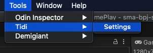
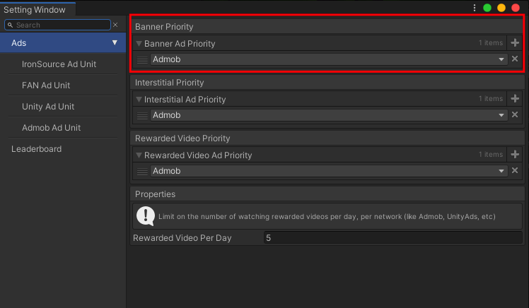
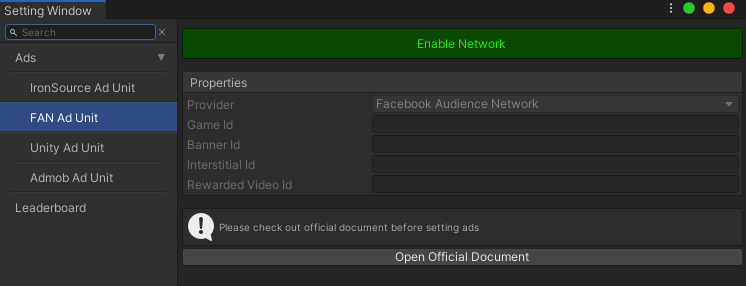
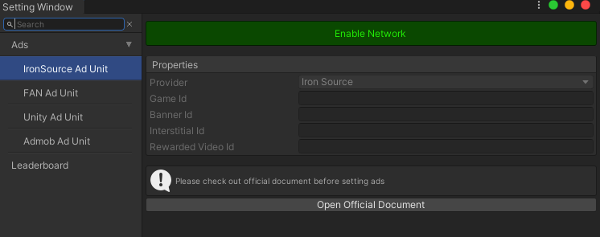

# **`Block Puzzle 1010 Star`**

### **Welcome**

Hi there, thank you for purchasing `Block Puzzle 1010 Star`!

I can tell you, this source code is not difficult to re-skin. All sprites locate in folder **`Assets/_MAIN/Textures/GamePlay`** and packed into an atlas by using `Unity Sprite Atlas`. 

This game has already integrated **`Admob`**, **`Facebook Audience Network`**, **`Unity Ads`**, **`IronSource`**, and **`Google Play Service Leaderboard`**. They are easily to configure with detail documents below. You should check it out. 

Source code is working on **`Unity 2019.4.14f1 LTS`**, you should not use on older Unity version.

If you like this source code, please give it a review/rating in the `SellMyApp` website as it will help me to improve this source code and others.

### **Contact Info**

For bugs, feature requests and a friendly chat, you can send an email to:
<tidi.productions@gmail.com>

I will always answer as soon as possible. Thank you.

&nbsp;

### **Important documents you should check out before using**

### **`Setting Window`**

Open **`Setting Window`** from menu: **`Tools/Tidi/Settings`**

### **`Ad Priority`**

We need `Ad Priority` if multiple `Ad Network` have enabled. Check out the image below, we use only `Admob` for showing ad. If we need `Unity Ad`, `FAN`, or `IronSource`, just add them into list. Which first has higher priority.

For enable `Ad Network` and change `Unit Ids`, check below.

### **`Ad Unit Ids`**

Enable/Disable `Ad Network` mean we add/remove `Scripting Define Symbols` like `USING_ADMOB`, `USING_UNITY_ADS`, `USING_FAN`, `USING_IRONSOURCE`. If `Ad Network` has been disable, it should not be in the build. 

Check out each Network's official document for creating unit id. Then complete the setting.

- Admob Unit Setting

- Unity Unit Setting

- Facebook Audience Network Unit Setting

- IronSource Unit Setting

### **`Leaderboard`**

Check out Leaderboard's official documents and complete the setting.

### **`How to add new block`**

It is a little complicated to add new block. So I uploaded a step by step video to guide you guys:

[Tutorial video](https://youtu.be/Q2d7c_pYvO4)

There are 3 steps: 

1. Create Block prefab

You can use an old block in folder `_MAIN/Prefabs/Blocks/`, duplicate, drag to `Hierarchy`, unpack prefab, change name, remove `Poolable Info` script. Then add more `Cell Elements`, rearrange them. When everything is done, let press the button `Setup Block Children`. This function will place elements in the right position and store those positions. After that, we can make a new prefab. 

2. Add Block to Object pool

Find object PoolBoss in `Hierarchy`, add new item in category `Blocks`, drag new `Block Prefab` into this new item. Tick on property `Allow Instantiate More`, so Object Pool can create this block more than one. Then Save. 

3. Add Block to Block Spawner Rule Configures

Check out config: `_MAIN/Configures/Block Configures.asset`, you should see something like that in tab `Inspector`

Create new block item, scroll to bottom, you can see an empty item. Add prefab, add at least one `Available Angles`. Then back to top, press 2 buttons: `Generate Blocks's Id`, `Generate Blocks's Data`. After saving, you should try to enter the game for testing. 

There are some properties maybe you should take notice in `Block Configures.asset`:

- `Block Spawn Count Per Row`: default is 60. Each spawned block count as one, so after 60 times, some block spawner rule should be reset, like `Limit Count On A Row`

- `Limit Count On A Row`: default is -1, that mean no limit for this block. If value is 0, this block should never be spawned. If value is >= 1, in each row (60 spawning times), this block can not be spawned more than the limit 

- `Available From Spawn Count`: default is 0. This block can be spawned when `Spawn Count` is >= @value. Some blocks is pretty hard, so you want them only appear after 60 spawning times, let set the value is 60.